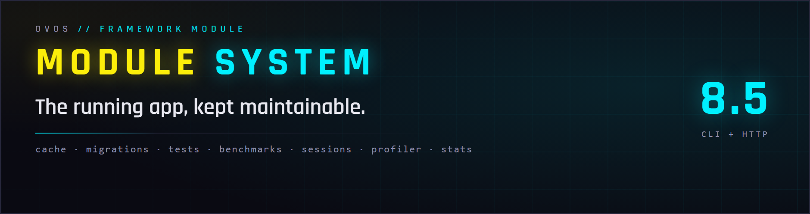
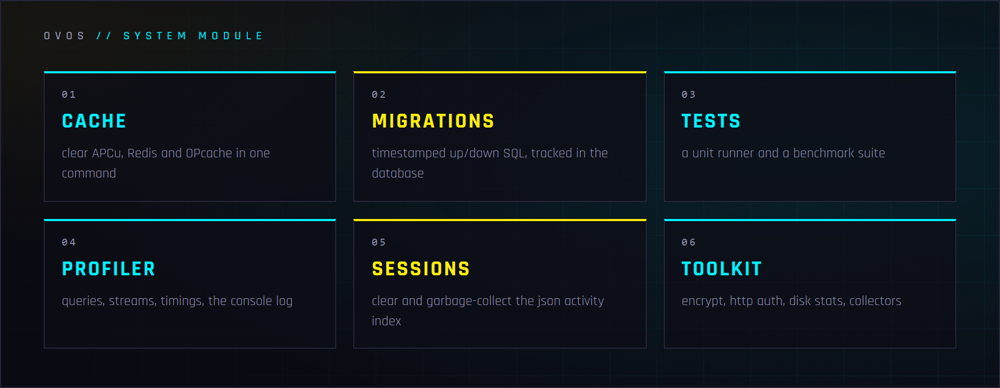

<p align="center">
	
</p>

# ovos php-module-system

The **system administration module** for applications built with
[ovos/php-library](https://github.com/ovos/php-library) — the CLI and HTTP
tooling that keeps a running app maintainable: cache control, database
migrations, a test/benchmark runner, session and log housekeeping, error pages,
encryption utilities and the profiler helpers.

**Licence:** [PolyForm Noncommercial 1.0.0](LICENSE.md) — read it, run it, learn from it; commercial use needs a word with us.

<p align="center">
	
</p>

**GitHub:** https://github.com/ovos/php-module-system

## What's inside

Register the module once (see [Installation](#installation)) and these land on
your CLI and in your app:

- **⚡ One-shot cache control** — clear all three tiers (APCu, Redis, OPcache) with a single `system cache clear`; APCu and OPcache are flushed through token-authenticated internal HTTP calls, since they are per-process. → [Cache Management](#cache-management)
- **🗂 Database migrations** — timestamped `up`/`down` SQL, discovered across configured directories and tracked in a `migrations` table. → [Migrations](#migrations)
- **🧪 Test & benchmark runner** — discovers and runs test/benchmark classes with per-item time and memory, grouped pass/fail/skip, and a non-zero exit on failure. → [Tests](#tests)
- **📡 Profiler helpers** — queries, outbound HTTP streams, timings, console log and messages, rendered as HTML *or* ASCII tables. → [Profiler Helpers](#profiler-helpers)
- **🧹 Session & log housekeeping** — clear sessions, garbage-collect the json handler's activity index, and prune old log files via collectors. → [Sessions](#sessions) · [Collectors](#collectors)
- **🔒 Ops toolkit** — string encrypt/decrypt, HTTP Basic Auth middleware, disk-space stats. → [Encryption Tools](#encryption-tools) · [HttpAuth](#httpauth)

Works alongside:
- https://github.com/ovos/php-library (core MVC framework)
- https://github.com/ovos/php-module-admin (administration panel)

## Requirements

* PHP 8.3 - 8.5
* ovos/php-library

## Table of Contents

- [What's inside](#whats-inside)
- [Installation](#installation)
- [Project Structure](#project-structure)
- [CLI Commands](#cli-commands)
  - [Cache Management](#cache-management)
  - [Migrations](#migrations)
  - [Tests](#tests)
  - [Benchmarks](#benchmarks)
  - [Collectors](#collectors)
  - [Sessions](#sessions)
  - [Stats](#stats)
  - [Encryption Tools](#encryption-tools)
- [Plugins](#plugins)
  - [HttpAuth](#httpauth)
  - [Locales](#locales)
  - [Vendor](#vendor)
  - [User](#user)
- [Widgets](#widgets)
- [Error Handling](#error-handling)
- [Profiler Helpers](#profiler-helpers)
- [Migrations In Depth](#migrations-in-depth)
- [Configuration Reference](#configuration-reference)

---

## Installation

1. Add to your project's `composer.json`:
```json
{
  "repositories": [
    { "type": "git", "url": "https://github.com/ovos/php-module-system.git" }
  ],
  "require": {
    "ovos/php-module-system": "dev-release/8.5"
  }
}
```

3. Install:
```bash
composer install
```

4. Register the module in `application/configs/environments.yml`:
```yaml
system:
  modules:
    system:
      path: vendor/ovos/php-module-system/application
      controllers: true
      translations: true
      views: true
```

---

## Project Structure

```
php-module-system/
├── composer.json
├── application/
│   ├── controllers/
│   │   ├── Benchmarks.php                      # Benchmark runner (extends Tests)
│   │   ├── Migrations.php                      # Migration management
│   │   ├── Tests.php                           # Test runner
│   │   └── System/
│   │       ├── Cache.php                       # Cache clearing (APCu, Redis, OPcache)
│   │       ├── Collector.php                   # Garbage collection (logs, etc.)
│   │       ├── Events.php                      # Error/exception display
│   │       ├── Sessions.php                    # Session management
│   │       ├── Stats.php                       # System statistics
│   │       └── Tools.php                       # Encryption/decryption utilities
│   ├── models/
│   │   └── Migration.php                       # Migration record model
│   ├── stores/
│   │   └── Migrations.php                      # Migration record store
│   ├── plugins/
│   │   ├── HttpAuth.php                        # HTTP Basic Authentication
│   │   ├── Locales.php                         # Locale/translation management
│   │   ├── User.php                            # Authenticated user access
│   │   └── Vendor.php                          # Vendor-specific translations
│   ├── migrations/
│   │   ├── 20210225000000_Migrations.php       # Creates the migrations table
│   │   ├── 20210225000000_Migrations_up.sql
│   │   └── 20210225000000_Migrations_down.sql
│   ├── translations/
│   │   └── phrases.php                         # Translation key registry
│   ├── views/
│   │   ├── events.phtml                        # Error/exception page
│   │   └── helpers/
│   │       ├── benchmark.phtml                 # Benchmark profiler output
│   │       ├── console.phtml                   # Console messages output
│   │       ├── debug.phtml                     # Debug CSS placeholder
│   │       ├── messages.phtml                  # User-facing messages
│   │       ├── queries.phtml                   # Database query profiler
│   │       └── streams.phtml                   # HTTP request profiler
│   └── widgets/
│       ├── Menu.php                            # Menu widget
│       └── Menu/
│           └── Item.php                        # Menu item
```

---

## CLI Commands

### Cache Management

```bash
# Clear all cache types (perishable, persistent, OPcache)
php cli.php system cache clear

# Clear only persistent cache (Redis)
php cli.php system cache clear-persistent

# Run garbage collection on persistent cache
php cli.php system cache collect-garbage
```

The cache controller handles three tiers:
- **Perishable (APCu)** - per-worker memory cache, cleared via an HTTP callback (APCu is per-process)
- **Persistent (Redis)** - distributed cache, cleared directly and libraries reloaded
- **OPcache** - PHP bytecode cache, cleared via an HTTP callback

When the application has a configured `SYSTEM_HOST`, perishable and OPcache clearing
is done through internal HTTP requests with token-based authentication.

### Migrations

```bash
# Show status of recent migrations (last 20)
php cli.php migrations status

# Run all pending migrations
php cli.php migrations run

# Run next N pending migrations
php cli.php migrations run 1

# Rollback last migration
php cli.php migrations rollback

# Rollback last N migrations
php cli.php migrations rollback 3
```

The migration controller scans all directories configured in `config.system.migrations`,
discovers migration files by their `{timestamp}_{Name}.php` naming convention, and
tracks execution state in a `migrations` database table.

### Release Stamp

```bash
# Write the checkout's git revision to BASE_DIR/.release
php cli.php release stamp
```

The stamp gives error reports a real deploy label: the console groups issues
by the release they first appeared in, which only works when deployments carry
one. Run it from the deploy script after the code update (and after caches are
rebuilt, on the deploy that first ships this controller). The command prints
what it wrote; a checkout without a git revision logs "nothing written" and
exits clean — the stamp is deploy metadata and must never fail a deploy. A
configured `console.release` outranks the file on the consuming side, so the
stamp is a fallback, never an override.

### Tests

```bash
# Run all tests
php cli.php tests run

# Run a specific test class
php cli.php tests run Router

# Run a specific test method
php cli.php tests run Router parametersNamedSkipOptional
```

The test runner discovers test classes from paths configured in `config.system.tests`.
Results are grouped into Passed, Failed, Completed, and Skipped categories with
time and memory measurements. Exits with code 1 if any tests fail.

### Benchmarks

```bash
# Run all benchmarks
php cli.php benchmarks run

# Run a specific benchmark class
php cli.php benchmarks run CacheBench
```

The benchmark controller extends the test runner with paths from `config.system.benchmarks`
and the `Benchmarks` namespace.

### Collectors

```bash
# Run all configured garbage collectors
php cli.php system collector
```

Invokes all collectors defined in `config.system.collectors`. The built-in log collector
deletes `.txt` log files from `application/logs/` older than the configured number of days.

### Sessions

```bash
# Clear all sessions
php cli.php system sessions clear
```

### Stats

```bash
# Display disk free space (formatted)
php cli.php system stats free-space
```

Also accessible via HTTP for monitoring purposes.

### Encryption Tools

```bash
# Encrypt a string
php cli.php system tools encrypt "my secret text"

# Decrypt a string
php cli.php system tools decrypt "encrypted_string"
```

Uses the encryption method and key configured in `config.encryption`.

---

## Plugins

Plugins hook into the controller lifecycle and run before/after every action dispatch.
Register them in `environments.yml` under `system.plugins`.

### HttpAuth

HTTP Basic Authentication middleware.

**Symbol:** `http_auth`

```yaml
http_auth:
  enabled: yes
  username: admin
  password: secret
  realm: "Restricted Area"
  whitelist:
    - 127.0.0.1
    - 192.168.1.0/24
```

- Checks `PHP_AUTH_USER` and `PHP_AUTH_PW` against configured credentials
- Whitelisted IPs bypass authentication entirely
- Returns `401 Unauthorized` with `WWW-Authenticate` header on failure

### Locales

Manages locale and translation state per request.

**Symbol:** `locales`

- Updates locale lock state for the current controller
- Sets the translator to the request's locale
- Falls back to the default locale when the current locale is locked for a controller
- Ensures locked locales are never rendered (prevents missing translations)

Locale locking is configured per-locale in `environments.yml`:
```yaml
locales:
  de:
    symbol: de_AT
    default: yes
  en:
    symbol: en_US
    controllers:        # Only unlock English for these controllers
      - Index
      - About
```

### Vendor

Loads vendor-specific translation overrides from modules.

**Symbol:** `vendor`

When `config.vendor` is set, this plugin scans all modules that have both `translations`
and `vendor` enabled, and registers additional translation paths:

```
{module.path}/translations/{vendor}/
```

This allows the same module to carry different translations per project.

### User

Provides access to the authenticated user.

**Symbol:** `user`

```php
// In a controller
$user = $this->user()->user();

if($user)
{
    // User is authenticated
}
```

Depends on `Ovos\Service\Auth` being registered. Returns `null` if the auth
service is not configured.

---

## Widgets

### Menu

A menu widget with automatic active-state detection based on the current URL.

```php
use Widgets\Menu;

$menu = new Menu('widgets/footer-menu.phtml');
$menu->add(new Menu\Item($this->_('Home'), '/'));
$menu->add(new Menu\Item($this->_('Contact'), 'contact'));
$menu->add(new Menu\Item($this->_('Privacy'), 'privacy', 'Privacy Policy'));

echo $menu;
```

- Items are marked active when the current URL starts with the item's URL
- Supports method chaining: `$menu->add($item1)->add($item2)`
- Custom URL can be set via `$menu->setUrl($url)` to override auto-detection
- Renders via configurable `.phtml` template (default: `widgets/menu.phtml`)

#### Menu\Item

```php
$item = new Menu\Item('Label', 'controller/action', 'Optional tooltip');
$item->setActive(true);
$item->isActive();       // true
$item->getLabel();       // 'Label'
$item->getUrl();         // '/controller/action'
$item->getTitle();       // 'Optional tooltip'
```

---

## Error Handling

The `System\Events` controller handles error and exception display for both HTTP and CLI.

**HTTP behavior:**
- Sets appropriate HTTP status codes: `404` for NotFoundException, `403` for ForbiddenException, `500` for others
- Renders a styled error page with back button
- Shows exception stack traces only when `config.system.debug` is enabled

**CLI behavior:**
- Outputs color-coded error names and messages
- Displays raw exception stack traces

The error controller is invoked automatically by the framework when an unhandled
exception occurs during request dispatch.

---

## Profiler Helpers

When profiling is enabled in config, these view helpers append debug information
to the response. Each helper renders in both HTTP (as HTML tables) and CLI
(as ASCII tables) format.

| Helper | Description |
|--------|-------------|
| `benchmark.phtml` | Request timings and memory measurements per marker |
| `console.phtml` | Console log messages with timestamps |
| `queries.phtml` | Executed database queries with timing |
| `streams.phtml` | Outbound HTTP requests with method, URL, and timing |
| `messages.phtml` | User-facing messages (error, warning, info, success) |

Enable profiling in `environments.yml`:
```yaml
system:
  profilers:
    enabled: yes
    queries:
      limit: 20
    append:
      http: no
      cli: yes
    helpers:
      - queries
      - console
      - benchmark
```

---

## Migrations In Depth

### Creating a Migration

Create a PHP file and companion SQL files in your migrations directory:

**`application/migrations/20250101000000_CreateProducts.php`:**
```php
<?php
declare(strict_types=1);

namespace Migrations;

use Ovos\Migration;

class CreateProducts extends Migration
{
    public function up(): void
    {
        $this->upSql();
    }

    public function down(): void
    {
        $this->downSql();
    }
}
```

**`20250101000000_CreateProducts_up.sql`:**
```sql
CREATE TABLE products (
    id INT UNSIGNED AUTO_INCREMENT PRIMARY KEY,
    name VARCHAR(255) NOT NULL,
    price DECIMAL(10,2) NOT NULL,
    created_at DATETIME DEFAULT CURRENT_TIMESTAMP,
    modified_at DATETIME DEFAULT NULL ON UPDATE CURRENT_TIMESTAMP
) ENGINE=InnoDB DEFAULT CHARSET=utf8mb4;
```

**`20250101000000_CreateProducts_down.sql`:**
```sql
DROP TABLE IF EXISTS products;
```

### File Naming Convention

```
{timestamp}_{Name}.php          # Migration class
{timestamp}_{Name}_up.sql       # Up SQL (applied by $this->upSql())
{timestamp}_{Name}_down.sql     # Down SQL (applied by $this->downSql())
```

The timestamp format is `YYYYMMDDHHmmss` (e.g., `20250101000000`). This serves as
both the migration ID and the execution order.

### Organizing Migrations

Migrations can be organized into subdirectories:
```
application/migrations/
├── Initial/
│   ├── 20210226000000_Struct.php
│   ├── 20210226000000_Struct_up.sql
│   └── 20210226000000_Struct_down.sql
├── Updates_2024/
│   └── 20240601000000_AddUserRoles.php
└── Updates_2025/
    └── 20250101000000_CreateProducts.php
```

### Migration Tracking

Migrations are tracked in the `migrations` database table (created by the first
bundled migration `20210225000000_Migrations`):

| Column | Description |
|--------|-------------|
| `id` | Migration ID (from filename timestamp) |
| `name` | Migration name (from filename) |
| `created_at` | Record creation timestamp |
| `modified_at` | Record modification timestamp |
| `migrated_at` | When the migration was applied |
| `rolled_back_at` | When the migration was rolled back |

### Registering Migration Paths

```yaml
system:
  migrations:
    - vendor/ovos/php-module-system/application/migrations
    - application/migrations
```

---

## Configuration Reference

This module reads the following configuration paths from `environments.yml`:

| Config Path | Description |
|-------------|-------------|
| `system.modules` | Module definitions (path, controllers, translations, views, vendor) |
| `system.migrations` | Array of directories to scan for migration files |
| `system.tests` | Array of directories to scan for test classes |
| `system.benchmarks` | Array of directories to scan for benchmark classes |
| `system.collectors` | Garbage collection configuration |
| `system.collectors.{name}.controller` | Controller to invoke |
| `system.collectors.{name}.action` | Action method to call |
| `system.collectors.{name}.days` | Max age in days for log files |
| `system.debug` | Show exception details in error pages |
| `system.profilers` | Profiler/debug output settings |
| `system.locales` | Locale definitions with optional controller locks |
| `vendor` | Vendor name for vendor-specific translation paths |
| `encryption.method` | Encryption algorithm (e.g., `AES-128-GCM`) |
| `encryption.key` | Encryption key |
| `http_auth.enabled` | Enable HTTP Basic Auth |
| `http_auth.username` | Auth username |
| `http_auth.password` | Auth password |
| `http_auth.realm` | Auth realm |
| `http_auth.whitelist` | Array of IPs to bypass auth |
